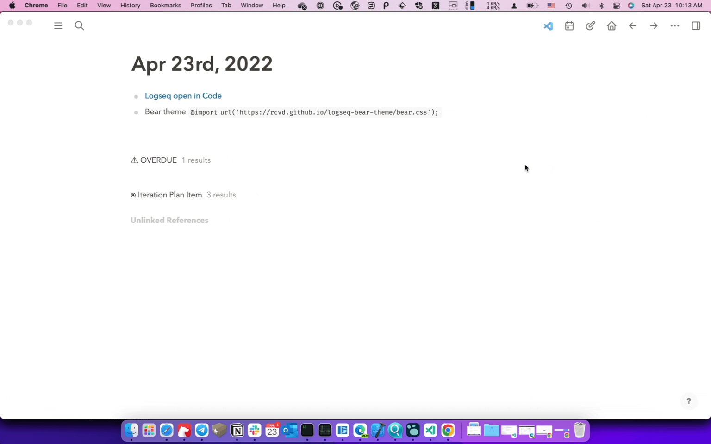

## Open Logseq in VS Code

Open and edit Logseq pages and config files in VS Code

## How to Use

The application provides default keyboard shortcuts for ease of use:
- To open the graph, use `mod+shift+o`.
- To open the current page, use `mod+o`.
- To open the current block, use `mod+alt+o`.

Alternatively, you can enter the command names in the command palette to execute the corresponding commands.

Please note that Logseq has an existing keybinding `ctrl+d ctrl+a` which opens the current page in the default app.

Not just vscode, it is possible to open in any application that uses URL schemes. In the source code, you can modify the `generateUrl` function in `src/App.vue` to add more applications.

## Development Instructions

To set up the development environment:
- Run `npm install` in the terminal to install the necessary dependencies.
- Use `npm run build` or `npm run watch` to build the application.
- Use the `Load unpacked plugin` option in the Logseq Desktop client to load the plugin.